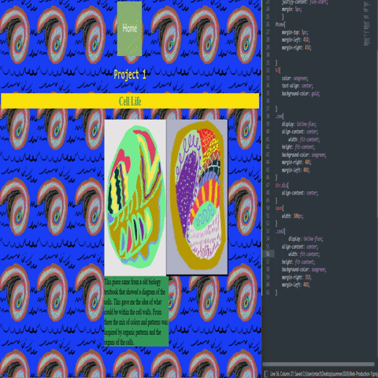
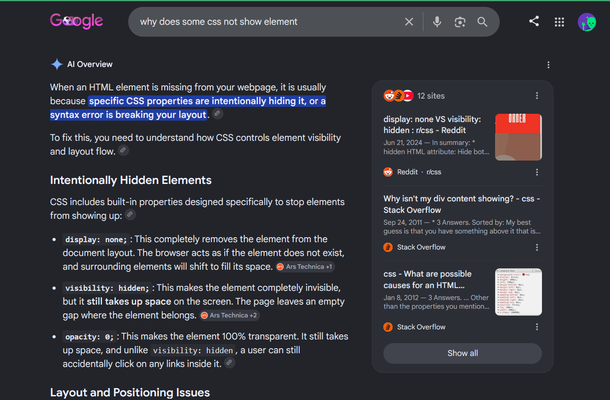

# Project 1 

1.Inspiration:
The inspiration of this site was to understand how to present my art and display it in a way that shows I have an understanding of the positioning using margins and tags. I made the site mainly with a simple diagram that would fit within the page without scrolling. 

2. sketches:
*

*

The idea was mainly to show 4 pieces of digital drawn art and explain each piece and the process behind it in their own web page.

3. technical problems:

When adjusting the span text the issue when making it for the art 2 page to make the text fit both images and to keep everything centered I had to adjust the margins with percentages and and customizing the image to fit within 250 pixels width and a adjusted height to fit the page. During the first few hours I had issues with the CSS due to a overlook for one of the elements missing the end curly bracket which was frustrating till fixed. Given the slight adjustments to make sure the page is simple but with the use of my custom designs and photoshop to give it a vase complicated look to it.
4. references:
* [CSS The display Property](https://www.w3schools.com/css/css_display.asp)

  
*[Responsive Image Gallery](https://www.w3schools.com/css/tryit.asp?filename=trycss_image_gallery_responsive)

*

*[How to Fix CSS Not Working in Your Website 👌 | Website CSS Not Updating Fix | HTML and CSS Tutorial by Dani Krossing](https://www.youtube.com/watch?v=F8vORrGWl-g)
