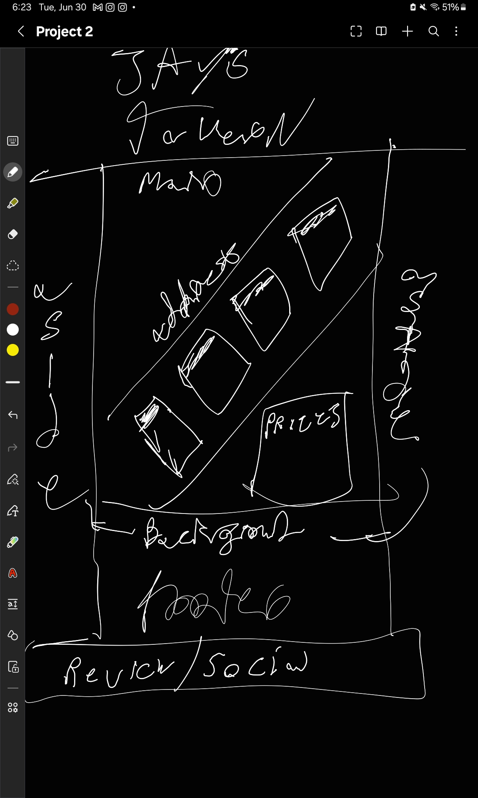
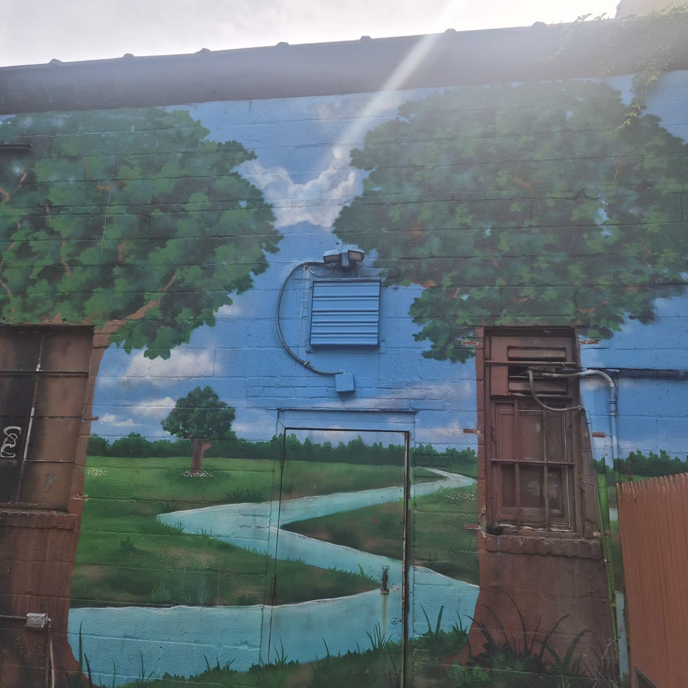
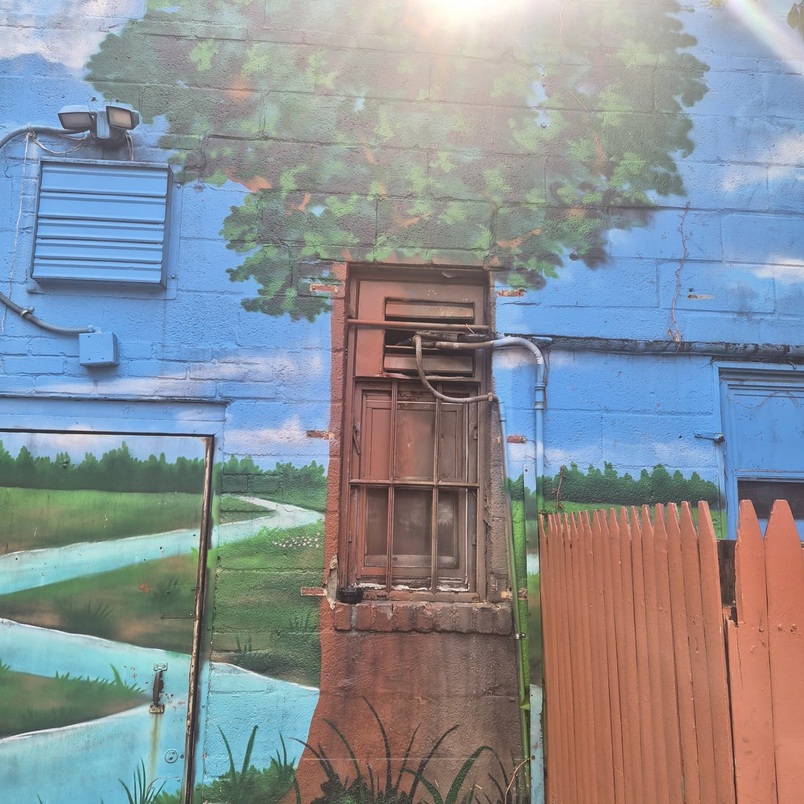
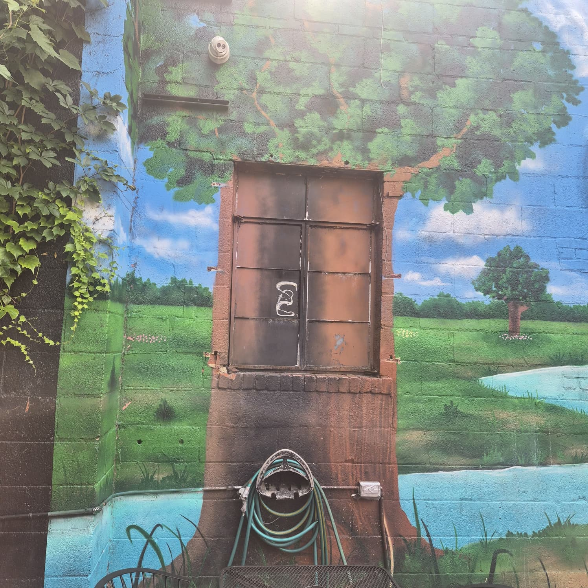
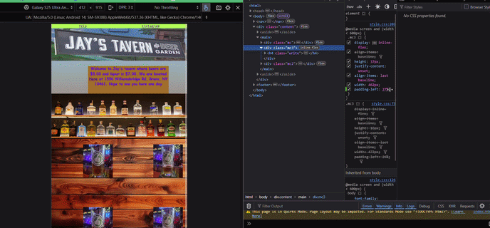
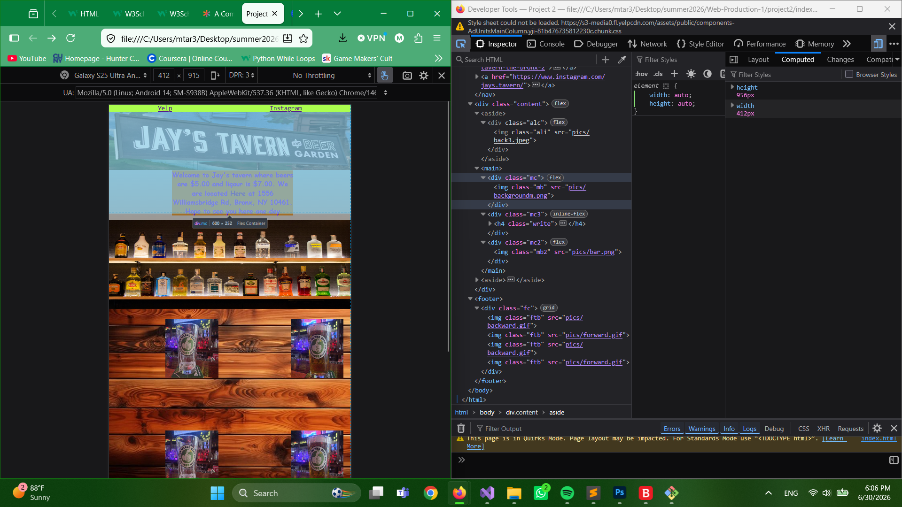

## Inspiration

> When looking for inspiration I went to some small time sites that promoted bars and went to the location of the bar to see the fitting nature of the environment. This is where the selling point of the bar was the backyard's mural and followed the the color scheme for the background of the body and with the use of 2 beers made a gif to show it being emptied and refilling to show that the place has a feeling of abundence.

## Sketches
*
*
*
*
> Include any sketches you made *before* you started coding

## Technical Process

> I was experimenting the layout as if the backyard pics are arches and the middle is a bar and a table with beers being refilled and emptied. The positioning of the beers and the text was a pain for the ohone version and the site due to the div blocks mixing with the over lapping images. and to fill in the bottom area with items but got lost in the research trying to make it look better.
> 
> 
 
> 

## References

*https://www.w3schools.com/html/html_images.asp
*https://www.w3schools.com/html/tryit.asp?filename=tryhtml_images_style
*https://css-tricks.com/complete-guide-css-grid-layout/
*https://www.are.na/rachel-steele/music-gig-posters-efsmeujirc4
*https://www.w3schools.com/css/css_align_horizontal.asp
*https://www.w3schools.com/css/css_background_image.asp
*https://www.w3schools.com/css/css3_mediaqueries_ex.asp