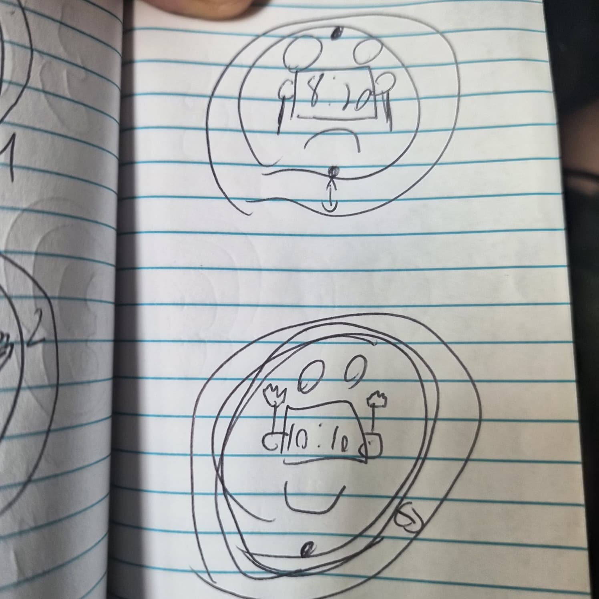
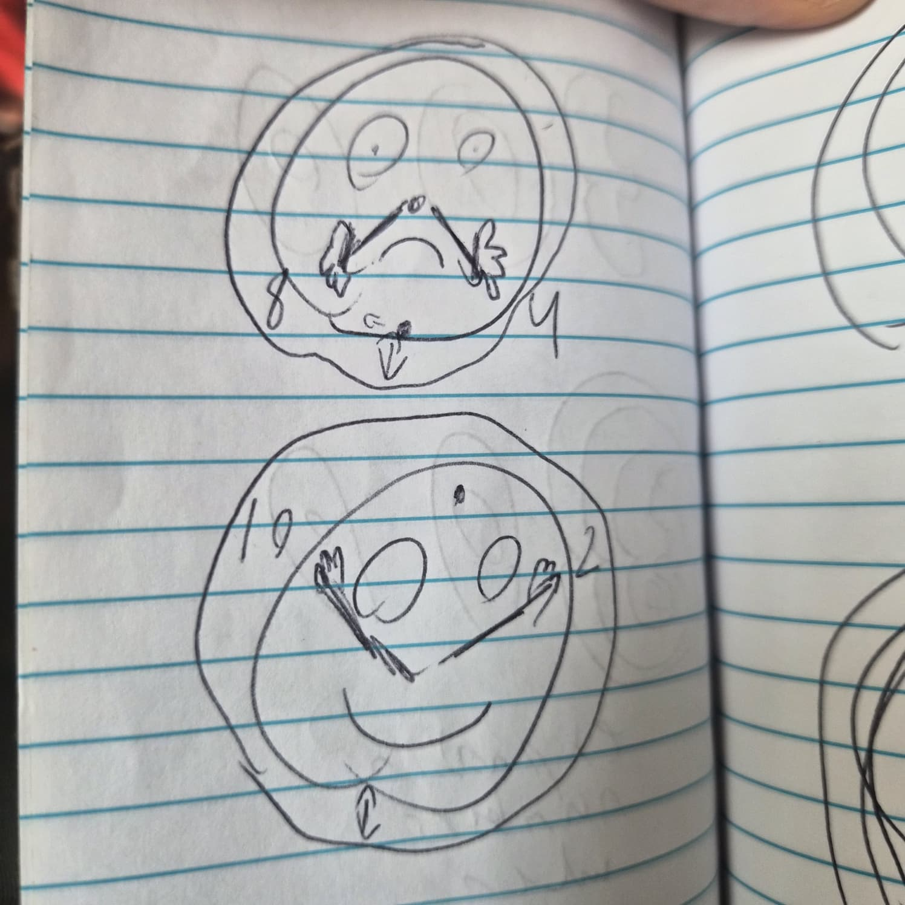
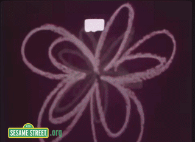

## Inspiration

> I wanted to give perception of certain times within a day with the use of the clock character to personify the feeling of the time during my day. Given that each time shows the energy and feeling and the actions behind each time to give it my perspective of it. Once I got the images together and the alignment right I want the dream bubble to be a way to refresh the page to show the routine of the clock.

## Sketches
*

*

## Technical Process

> In the beginning it was to get the layout of the page to show how it is percieved based on location of each character and what actions they will do. First to get the background to represent the environments around me during each time. One problem was aligning the text and the interactive link within the last image. Using anchor tags to scroll snap into the next image is where I had to make sure it fit in properly and with the use of javascript to use the interval function to snap at it at certain times. The hard part was to find the functions and get the clock to be accurate. Then fitting the screen for the webpage was a hard part when 100% was in the wrong part of the container.

## References
> https://www.magnific.com/
> https://dribbble.com/
> https://www.image-map.net/
> https://www.youtube.com/watch?v=ytl6TrroGis
> https://dribbble.com/shots/19383765-Night-and-day-clock-done-by-expressions-in-After-Effects
> https://www.clocktab.com/
> *
> *
> https://movingimage.org/event/the-jim-henson-exhibition/
> https://www.are.na/block/35853002
> https://developer.mozilla.org/en-US/docs/Web/CSS/Reference/Properties/scroll-snap-stop
>https://github.com/samheckle/hunter-web-projection-1-su26/blob/main/class_13/class-13-notes.md