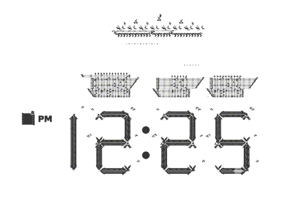

## 1. Description:
When thinking about the concept of the clock all I was thinking was, what is a clock was used for? The idea was it has a feeling of movement and a way to track what is happening and what can happen which made it feel like a living being with the use of motion and expression of feelings. So the concept of this is in the middle of the page the user has a option of either digital or analog as the model and within a minute the outline of the model would beat or expand within a smal range like a heart(60 beats a minute) to represent the seconds passing by and for the emotional side, there ae certain times on a clock that makes it look like a face example(8:20/4:40 = sad face or 10:10/2:50 = happy face). At certain times the clock would change the background within the outline into a animated face and last for a minute. Giving the arms of the analog clock cartoonish animated hands but for the digital it would be within a rectangle container and arms on the side hanging down and when it reaches one of the emotional times, the hands would be up as if it was excited, this would be within the analog clock design background. The background behind the analog clock would have multiple location settings( example: city, town, field, or beach) so it could feel customizable for the user and give the clock more of a personality. A plus would be able to adjust the time manually to show the emotional times anytime.

## 2. Sketches:
*

*
## 3. references:
*

*

*https://movingimage.org/event/the-jim-henson-exhibition/

*https://www.are.na/block/35853002

*https://www.clocktab.com/

*https://dribbble.com/shots/19383765-Night-and-day-clock-done-by-expressions-in-After-Effects